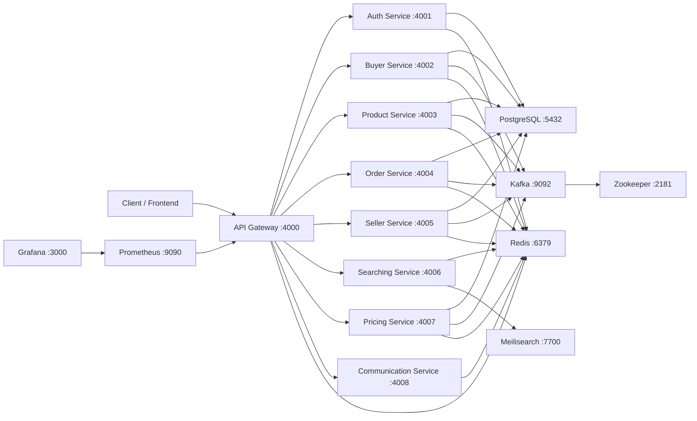

# CartCraft

CartCraft is a microservices-based ecommerce platform with separate services for authentication, buyers, sellers, products, orders, search, communication, and AI-assisted pricing. The system is designed around service isolation, internal HTTP communication, event-driven workflows with Kafka, background jobs with Redis/BullMQ, and Kubernetes-ready deployment manifests.

The existing older documentation is kept in `reamme.md`. This README is a cleaner, current project guide based on the repository structure, Docker Compose file, backend services, and Kubernetes manifests.

## What This System Contains

- API Gateway as the public entry point
- Node.js services for auth, buyers, sellers, products, orders, search, and communication
- FastAPI pricing service with LangGraph/Gemini-based pricing proposal flow
- PostgreSQL for persistent service data
- Redis for queues, transient state, and pricing signals
- Kafka and Zookeeper for event streaming
- Meilisearch for product search
- Prometheus and Grafana for metrics and dashboards
- Kubernetes manifests organized by config, secret, deployment, service, and infra

## Architecture



## Service Map

| Service | Folder | Internal DNS / Compose name | Port | Main role |
| --- | --- | --- | --- | --- |
| API Gateway | `backend/apiGateWay` | `apigateway` / `api-gateway` in K8s | `4000` | Public routing, auth middleware, metrics |
| Auth Service | `backend/authService` | `authservice` | `4001` | Signup, login, user identity |
| Buyer Service | `backend/buyerService` | `buyerservice` | `4002` | Buyer cart, buyer orders, buyer workflows |
| Product Service | `backend/productservice` | `productservice` | `4003` | Products, variants, inventory, reviews |
| Order Service | `backend/orderService` | `orderservice` | `4004` | Checkout, order lifecycle, payment callback |
| Seller Service | `backend/sellerservice` | `sellerservice` | `4005` | Seller profile, seller orders, seller analytics |
| Searching Service | `backend/searchingservice` | `searchingservice` | `4006` | Product search with Meilisearch |
| Pricing Service | `backend/pricingservice` | `pricingservice` | `4007` | AI pricing proposals and approvals |
| Communication Service | `backend/communicationService` | `communicationservice` | `4008` | Email and background communication jobs |

## Repository Layout

```text
.
|-- backend/
|   |-- apiGateWay/
|   |-- authService/
|   |-- buyerService/
|   |-- communicationService/
|   |-- infra/
|   |-- orderService/
|   |-- pricingservice/
|   |-- productservice/
|   |-- searchingservice/
|   `-- sellerservice/
|-- frontend/
|   `-- pricing-admin/
|-- k8s/
|   |-- config/
|   |-- deployment/
|   |-- infra/
|   |-- secret/
|   `-- services/
|-- Docker-compose.yml
|-- README.md
`-- reamme.md
```

## Tech Stack

| Area | Technology |
| --- | --- |
| API services | Node.js, Express |
| Pricing service | Python, FastAPI, SQLAlchemy, Alembic |
| AI pricing | LangGraph, LangChain, Gemini, LangSmith |
| Databases | PostgreSQL |
| Cache and queues | Redis, BullMQ |
| Events | Kafka, Zookeeper |
| Search | Meilisearch |
| Frontend admin | React, Vite, Tailwind CSS |
| Observability | Prometheus, Grafana, `prom-client`, Pino |
| Deployment | Docker Compose, Kubernetes |

## Local Development With Docker Compose

The easiest way to run the whole stack locally is Docker Compose.

```bash
docker compose -f Docker-compose.yml up --build
```

Useful local URLs:

| Component | URL |
| --- | --- |
| API Gateway | `http://localhost:4000` |
| Prometheus | `http://localhost:9090` |
| Grafana | `http://localhost:3000` |
| Meilisearch | `http://localhost:7700` |
| Kafka | `localhost:9092` |
| PostgreSQL | `localhost:5432` |
| Redis | `localhost:6379` |

The Compose setup uses one PostgreSQL container and creates these databases through `backend/infra/init-dbs.sql`:

- `auth_db`
- `buyer_db`
- `order_db`
- `pricing_db`
- `product_db`
- `seller_db`

Important: PostgreSQL init scripts only run when the database volume is first created. If `postgres_data_test` already exists, changing `backend/infra/init-dbs.sql` will not automatically create new databases inside the old volume.

## Running Services Manually

Most Node.js services are Express apps with their own `package.json`. A typical manual flow is:

```bash
cd backend/authService
npm install
node src/index.js
```

For the pricing service:

```bash
cd backend/pricingservice
pip install -r requirements.txt
alembic upgrade head
uvicorn app.main:app --host 0.0.0.0 --port 4007
```

For the pricing admin frontend:

```bash
cd frontend/pricing-admin
npm install
npm run dev
```

## Environment Variables

The services rely heavily on environment variables. In Docker Compose and Kubernetes, these are already wired using service DNS names such as `postgres`, `redis`, `kafka`, and `meilisearch`.

Common variables:

| Variable | Purpose |
| --- | --- |
| `PORT` | Service HTTP port |
| `DB_HOST`, `DB_PORT`, `DB_USER`, `DB_PASSWORD`, `DB_NAME` | PostgreSQL connection settings |
| `DATABASE_URL` | PostgreSQL connection URL for Node services |
| `REDIS_HOST`, `REDIS_PORT` | Redis connection |
| `KAFKA_HOST`, `KAFKA_PORT` | Kafka broker connection |
| `MEILI_HOST`, `MEILI_PORT` | Meilisearch connection |
| `JWT_SECRET` | Gateway/auth token signing secret |
| `GEMINI_API_KEY` | Gemini API key for AI pricing |
| `LANGSMITH_API_KEY`, `LANGSMITH_PROJECT`, `LANGSMITH_ENDPOINT` | LangSmith tracing configuration |

Do not commit real production secrets. For Kubernetes, secrets are stored under `k8s/secret/` using base64-encoded `data` fields.

## Kubernetes Deployment

Kubernetes manifests live in `k8s/` and are organized by resource type:

```text
k8s/
|-- config/       # ConfigMaps for services
|-- deployment/   # Application Deployments
|-- infra/        # Stateful infrastructure: Postgres, Redis, Kafka, Zookeeper, etc.
|-- secret/       # Kubernetes Secrets
|-- services/     # ClusterIP and headless Services
|-- ingress.yaml
`-- namespace.yaml
```

Apply the namespace first, then config/secrets, infra, services, deployments, and ingress:

```bash
kubectl apply -f k8s/namespace.yaml
kubectl apply -f k8s/config/
kubectl apply -f k8s/secret/
kubectl apply -f k8s/infra/
kubectl apply -f k8s/services/
kubectl apply -f k8s/deployment/
kubectl apply -f k8s/ingress.yaml
```

Stateful infrastructure uses StatefulSets and volume claim templates where persistent identity or storage matters:

- PostgreSQL
- Redis
- Kafka
- Zookeeper
- Meilisearch
- Prometheus
- Grafana

Kafka and Zookeeper use headless services because stable network identity is important for StatefulSet pods.

## Core Backend Flows

### Authentication

The API Gateway exposes auth routes and forwards login/signup requests to the Auth Service. JWT validation and protected route handling happen at the gateway layer.

### Checkout and Orders

The checkout flow moves through the API Gateway to the Order Service. The Order Service calls Buyer Service for cart data and Product Service for inventory checks/reservation. Payment callbacks are handled by the Order Service and can publish Kafka events for downstream services.

### Product and Inventory

Product Service owns product, variant, review, and inventory operations. Inventory reservation and release are separated from final order confirmation so the system can avoid overselling and recover from failed checkout flows.

### Search

Searching Service uses Meilisearch for full-text product lookup. It keeps search data separate from the main product database so read/search workloads can scale independently.

### AI Pricing

Pricing Service evaluates demand and product activity signals, stores pricing proposals, and exposes approval/rejection APIs. Approved proposals update product pricing through Product Service.

### Communication

Communication Service handles outbound email and notification jobs asynchronously through Redis/BullMQ so user-facing flows do not wait on email delivery.

## Observability

- API Gateway exposes `/metrics` for Prometheus.
- Prometheus config lives at `backend/infra/prometheus.yml`.
- Grafana runs locally on port `3000` in Docker Compose.
- Services use Pino or framework logging for application logs.

## Development Notes

- Internal service calls should use service DNS names, not `localhost`, inside Docker or Kubernetes.
- Keep the port map consistent across backend code, Compose, and K8s.
- Kubernetes Secrets must use base64 values under `data`.
- PostgreSQL, Redis, Kafka, Zookeeper, Meilisearch, Prometheus, and Grafana are stateful workloads in K8s.
- For Docker Compose, remember that `depends_on` controls start order, but the application should still retry external connections where possible.

## Quick Verification Commands

```bash
docker compose -f Docker-compose.yml config
kubectl apply --dry-run=client -f k8s/
```

For Node service syntax checks:

```bash
node --check backend/apiGateWay/src/index.js
node --check backend/authService/src/index.js
node --check backend/buyerService/src/index.js
node --check backend/orderService/src/index.js
node --check backend/productservice/src/index.js
node --check backend/searchingservice/src/index.js
node --check backend/sellerservice/src/index.js
node --check backend/communicationService/src/index.js
```

For pricing service Python checks:

```bash
python -m py_compile backend/pricingservice/app/main.py
```

## Project Summary

CartCraft is a production-style ecommerce system that demonstrates microservice boundaries, API Gateway routing, event-driven communication, AI-assisted pricing, inventory safety, async background processing, observability, Docker Compose local orchestration, and Kubernetes deployment design.
