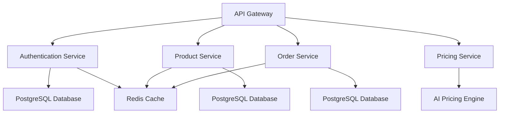

# CartCraft Full System Documentation

j# CartCraft Full System Documentation
## 1. Project Overview
CartCraft is an e-commerce platform designed to facilitate seamless interactions between buyers and sellers. The system aims to provide a robust, scalable, and efficient solution for online shopping, leveraging modern technologies and architectural patterns. The core features of CartCraft include user authentication, product management, order processing, and dynamic pricing strategies.  

## 2. System Architecture
CartCraft is built using a microservices architecture, where each service is responsible for a specific domain. The system utilizes an API Gateway to manage client requests and route them to the appropriate services. Communication between services is primarily event-driven, facilitated by Kafka, while Redis is used for caching and session management. PostgreSQL databases are employed for persistent storage, and an AI-based pricing service is integrated to optimize pricing strategies based on market trends and user behavior.

### 2.1 Microservices Architecture Overview

### 2.2 API Gateway Role
The API Gateway serves as the single entry point for all client requests. It handles authentication, request routing, and response aggregation. It also implements rate limiting and logging for monitoring purposes.
### 2.3 Service-to-Service Communication        
Services communicate with each other using RESTful APIs for synchronous operations and Kafka for asynchronous event-driven communication. This design allows for loose coupling and scalability.
### 2.4 Kafka Event-Driven Design
Kafka is used to facilitate communication between services in an event-driven manner. For example, when a buyer places an order, the Order Service publishes an event to Kafka, which is then consumed by the Inventory Service to update stock levels and the Pricing Service to adjust prices dynamically.
### 2.5 Redis Usage  
Redis is utilized for caching frequently accessed data, such as user sessions and product information, to improve performance and reduce latency.
### 2.6 PostgreSQL Databases
Each microservice has its own PostgreSQL database to ensure data isolation and maintain the integrity of the system. This design allows for independent scaling and maintenance of each service.
### 2.7 AI-Based Pricing Service
The AI-based pricing service analyzes market trends, competitor pricing, and user behavior to optimize product prices dynamically. It uses machine learning algorithms to predict demand and adjust prices accordingly, ensuring competitive pricing while maximizing revenue.

## 3. Repository Structure Explanation
The CartCraft repository is organized into several key folders:
- `.github`: Contains GitHub Actions workflows for CI/CD pipelines.
- `backend`: Contains all microservices, each in its own subfolder, responsible for different domains such as authentication, product management, order processing, and pricing.
- `frontend`: Contains the client application built using React, responsible for user interactions and API communication
- `k8s`: Contains Kubernetes manifests for deploying the application in a production environment.
- `docker-compose`: Contains Docker Compose files for local development and testing.

## 4. Backend Architecture
The backend architecture of CartCraft is designed to support the core functionalities of the platform while ensuring scalability and maintainability. Each microservice is responsible for a specific domain, and they interact with each other through well-defined APIs and event-driven communication.
### 4.1 Services and Responsibilities
- **Authentication Service**: Handles user registration, login, and JWT token management.
- **Product Service**: Manages product listings, including creation, updates, and retrieval.
- **Order Service**: Manages the order lifecycle, including order creation, payment processing, and order status updates.
- **Pricing Service**: Implements dynamic pricing strategies based on market trends and user behavior.
### 4.2 Authentication Flow
The authentication flow involves the following steps:
1. The user submits their credentials to the Authentication Service.
2. The service validates the credentials against the PostgreSQL database.
3. Upon successful authentication, a JWT token is generated and returned to the client.
4. The client includes the JWT token in the Authorization header for subsequent requests to other services.
### 4.3 Order Lifecycle
The order lifecycle includes the following stages:
1. **Order Creation**: The buyer initiates an order, which is processed by the Order Service.
2. **Payment Processing**: The Order Service interacts with a payment gateway to process the payment.
3. **Order Status Update**: The Order Service updates the order status and publishes an event to Kafka for other services to consume.
### 4.4 Seller Flow
Sellers can manage their product listings through the Product Service. They can create, update, and delete products, as well as view order statuses related to their products.
### 4.5 Buyer Flow
Buyers can browse products, add items to their cart, and place orders. They can also view their order history and track the status of their orders.
### 4.6 Pricing Strategy
The Pricing Service uses an AI-based approach to optimize product prices. It analyzes various factors such as market trends, competitor pricing, and user behavior to adjust prices dynamically. This ensures that the platform remains competitive while maximizing revenue.
### 4.7 Event-Driven Communication
The system uses Kafka for event-driven communication between services. For example, when an order is placed, the Order Service publishes an event to Kafka, which is then consumed by the Inventory Service to update stock levels and the Pricing Service to adjust prices dynamically.

## 5. Frontend Architecture
The frontend architecture of CartCraft is designed to provide a seamless user experience while interacting with the backend services. The frontend is built using React and follows a component-based architecture.
### 5.1 Tech Stack
The frontend is built using React for the user interface, Redux for state management, and Axios for API communication. The application is styled using CSS modules for modular and maintainable styles.
### 5.2 API Interaction
The frontend interacts with the backend services through the API Gateway. It sends HTTP requests to the API Gateway, which routes them to the appropriate services. The frontend also handles JWT token management for authentication and includes the token in the Authorization header for secure communication.
### 5.3 State Management
Redux is used for state management in the frontend application. It allows for a centralized store to manage the application state, making it easier to handle complex state interactions and maintain a predictable state flow.
### 5.4 Deployment Approach
The frontend application is deployed using Docker and Kubernetes. It is built into a Docker image and deployed as a Kubernetes Deployment, with an Ingress resource to manage external access.

## 6. Infrastructure & DevOps
The infrastructure and DevOps strategy for CartCraft is designed to ensure smooth development, testing, and deployment processes. The system uses Docker for containerization, GitHub Actions for CI/CD pipelines, and Kubernetes for orchestration in production.
### 6.1 Docker Strategy
Each microservice is containerized using Docker, with a separate Dockerfile for each service. The images are built and tagged using a consistent naming convention that includes the service name and version number. This allows for easy identification and management of images in Docker Hub.
### 6.2 Image Tagging Strategy
The image tagging strategy follows the format `service-name:version`, where `service-name` is the name of the microservice and `version` is the version number of the image. For example, the Authentication Service might have an image tagged as `authentication-service:1.0.0`.
### 6.3 GitHub Actions CI/CD Pipelines
GitHub Actions is used to automate the CI/CD pipelines for CartCraft. The pipelines include steps for building Docker images, pushing them to Docker Hub, and deploying updates to the production environment using Kubernetes. The pipelines are triggered on code pushes to the main branch and include stages for testing, building, and deployment.
### 6.4 Auto Deployment to EC2
The deployment to EC2 is automated through the CI/CD pipeline. When a new image is pushed to Docker Hub, the pipeline triggers a deployment update in Kubernetes, which manages the rolling update process to ensure zero downtime.
### 6.5 Kubernetes Setup
The Kubernetes setup includes Deployments for each microservice, Services to expose the Deployments, and an Ingress resource to manage external access. Horizontal Pod Autoscaling is configured to ensure that the system can scale based on demand, and resource requests and limits are defined to manage resource allocation effectively.

## 7. Deployment Architecture
The deployment architecture of CartCraft is designed to support both development and production environments. The development environment uses Docker Compose for local testing, while the production environment is orchestrated using Kubernetes.
### 7.1 Development Flow
In the development environment, developers can use Docker Compose to spin up all the necessary services locally. This allows for easy testing and debugging without the need for a full Kubernetes setup.
### 7.2 Production Flow
In the production environment, the application is deployed using Kubernetes. The CI/CD pipeline automates the deployment process, ensuring that new updates are rolled out smoothly with minimal downtime.
### 7.3 Rolling Updates
Kubernetes manages rolling updates to ensure that new versions of the application are deployed without downtime. During a rolling update, Kubernetes gradually replaces old pods with new ones, ensuring that the application remains available throughout the process.
### 7.4 Environment Configuration   
Environment variables are used to configure the application in both development and production environments. Kubernetes ConfigMaps and Secrets are used to manage configuration and sensitive information securely.

## 8. Observability
Observability is a critical aspect of the CartCraft system, ensuring that the health and performance of the application can be monitored effectively. The system uses Prometheus for metrics collection, Grafana for dashboard visualization, and a centralized logging strategy for troubleshooting and analysis.
### 8.1 Prometheus Metrics
Each microservice exposes Prometheus metrics, which are collected and stored in a Prometheus server. These metrics include information about request rates, error rates, latency, and resource usage.
### 8.2 Grafana Dashboards
Grafana is used to create dashboards that visualize the collected metrics from Prometheus. These dashboards provide insights into the performance and health of the application, allowing for proactive monitoring and troubleshooting.
### 8.3 Logging Strategy
The system implements a centralized logging strategy, where logs from all microservices are collected and stored in a central location. This allows for easy access and analysis of logs for troubleshooting and performance monitoring.
### 8.4 Health Checks
Each microservice implements health checks that can be used by Kubernetes to monitor the health of the application. These health checks include liveness and readiness probes to ensure that the application is running and ready to handle requests.

## 9. Security Considerations
Security is a paramount concern in the design of CartCraft. The system implements several security measures to protect sensitive information and ensure secure communication between services.
### 9.1 Secret Management
Secrets such as database credentials and API keys are managed securely using Kubernetes Secrets. These secrets are injected into the application at runtime, ensuring that sensitive information is not exposed in the codebase.
### 9.2 JWT Handling
JWT tokens are used for authentication and are securely generated and validated by the Authentication Service. The tokens include claims that provide information about the user and their permissions, and they are signed to prevent tampering.
### 9.3 Service Isolation
Each microservice is designed to be isolated from others, with its own database and limited access to other services. This isolation helps to contain potential security breaches and limits the impact of any vulnerabilities.
### 9.4 Network Policies
Network policies can be implemented in Kubernetes to restrict communication between services based on defined rules. This adds an additional layer of security by controlling which services can communicate with each other.

## 10. CI/CD Pipeline Flow
The CI/CD pipeline for CartCraft includes the following stages:
1. **Build**: The pipeline builds Docker images for each microservice using the respective Dockerfiles.
2. **Push to Docker Hub**: The built images are tagged and pushed to Docker Hub for storage and distribution.
3. **Deployment Update**: The pipeline triggers a deployment update in Kubernetes, which manages the rolling update process to deploy the new images.
4. **Rolling Update Behavior**: Kubernetes handles the rolling update process, ensuring that new pods are created and old pods are terminated gradually to maintain application availability throughout the update.

## 11. Future Improvements
- **GitOps Possibility**: Implementing GitOps for managing Kubernetes manifests and deployments could further automate and streamline the deployment process.
- **Advanced Monitoring**: Integrating more advanced monitoring tools and techniques, such as distributed tracing, could provide deeper insights into the performance and behavior of the application.
- **Blue/Green Deployment**: Implementing blue/green deployment strategies could further reduce downtime during updates and allow for easier rollback in case of issues.
- **Canary Releases**: Implementing canary releases could allow for gradual rollouts of new features, enabling testing in production with a subset of users before a full rollout.

